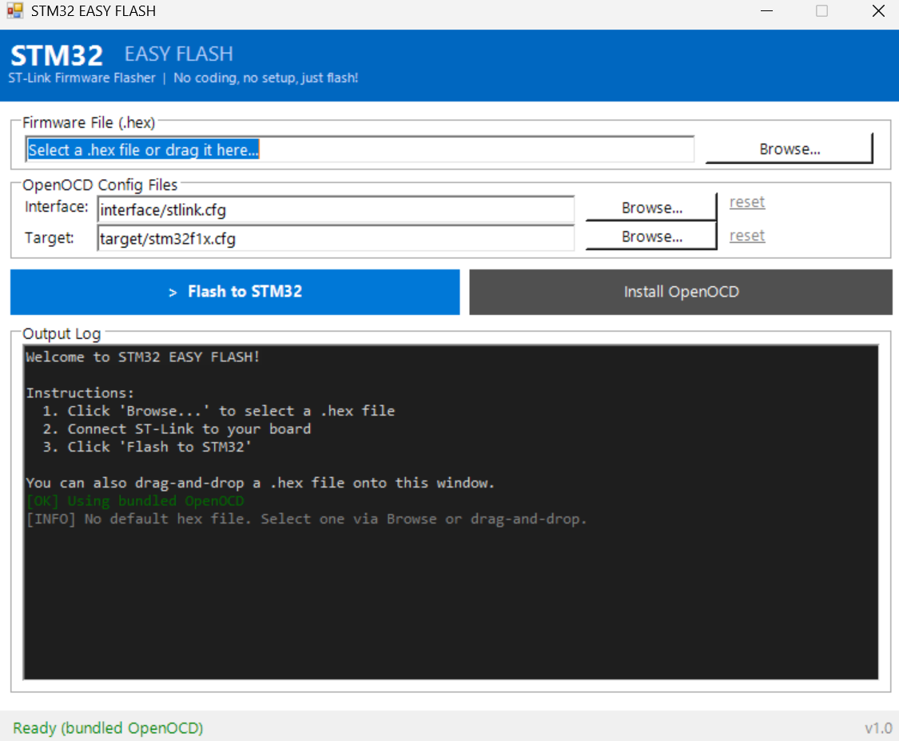

<p align="center">
  
  
  
  
</p>

# STM32 EASY FLASH

> **Zeroconf firmware flasher for STM32 via ST-Link.**  
> One click. No Python. No setup. No PATH pollution. Works on every OS.

Drag a `.hex` file, click **Flash**, done. The app ships as a **standalone executable** with **OpenOCD bundled inside** — unzip and run, nothing else to install.

<p align="center">
  
</p>

---

## 🧠 Motivation

I work in a robotics team with people from all backgrounds — hardware, mechanical, electrical, and software. Flashing firmware onto an STM32 board should not require understanding OpenOCD, drivers, or terminal commands.

Existing tools like STM32 Programmer are powerful but clunky and intimidating for non-developers. This project exists so **anyone on the team** can grab a `.hex` file, plug in an ST-Link, and flash in seconds — no explanations needed.

---

## 🚀 Quick Start

### 1. Download your zip

From the [latest release](../../releases/latest), grab the zip that matches your OS:

| OS | File | After unzipping, run |
|----|------|----------------------|
| 🪟 Windows | `EasyFlash-windows-x64.zip` | `EasyFlash.exe` |
| 🍎 macOS (Apple Silicon) | `EasyFlash-macos-arm64.zip` | `EasyFlash.app` |
| 🍎 macOS (Intel) | `EasyFlash-macos-x64.zip` | `EasyFlash.app` |
| 🐧 Linux (x64) | `EasyFlash-linux-x64.zip` | `./EasyFlash` |

The zip already contains **OpenOCD for that OS** — there is no download step, no Python, no tkinter, and nothing touches your system.

### 2. Flash

| Step | Action |
|------|--------|
| 1 | Unzip → launch the app |
| 2 | Click **Browse...** → select your `.hex` file |
| 3 | Connect ST-Link to the board |
| 4 | Click **Flash to STM32** ✅ |

> 💡 **macOS first launch** — the app is unsigned, so the first open may be blocked.
> Right-click `EasyFlash.app` → **Open**, then **Open** again in the dialog.

---

## ✅ Requirements

| Item | Notes |
|------|-------|
| **Nothing to install** | The executable bundles Python + tkinter + OpenOCD |
| **`.hex` firmware file** | From your build (e.g. `build/firmware.hex`) |
| **ST-Link programmer** | v2 or v3 — plug via USB |

> ℹ️ OpenOCD is bundled. The **Install OpenOCD** button only appears as a fallback
> if the bundled copy is somehow missing (it auto-re-downloads the xPack build).

---

## 🔌 ST-Link Driver

The ST-Link programmer needs a driver to communicate with OpenOCD.

> ⚠️ **First time plugging in ST-Link?** Plug it in and wait for your OS to finish auto-install before flashing.

| OS | Normal | Troubleshooting |
|-----|--------|----------------|
| **Windows** | Plug & play ✅ | Use [Zadig](https://zadig.akeo.ie/) → install **WinUSB** if you see `LIBUSB_ERROR` |
| **macOS** | Works out of the box ✅ | `brew install libusb` |
| **Linux** | Built into kernel ✅ | `sudo apt install libusb-1.0-0-dev` |

### 🐧 Linux — missing shared library?

If you see `error while loading shared libraries` when flashing:

```bash
sudo apt update
sudo apt install libftdi1-2 libhidapi-hidraw0 libusb-1.0-0
```

The error message tells you exactly which `.so` is missing — `apt install` the matching package.

---

## 🔒 Safety Guarantees

| What we don't touch | |
|-------------------|---|
| System `PATH` | 🚫 Never modified |
| Registry / dotfiles | 🚫 Never modified |
| Admin / root rights | 🚫 Never required |
| Global installs | 🚫 Never performed |
| OpenOCD location | ✅ Only inside the app folder |
| Working directory | ✅ Always relative to the app |

---

## 📦 How the build works

Two GitHub Actions workflows produce the standalone apps:

1. **`.github/workflows/publish-builder.yml`** — builds a **Docker builder image**
   (`packaging/Dockerfile`: Ubuntu 22.04 + Python/tkinter + PyInstaller) and
   publishes it to GHCR as `ghcr.io/<owner>/easy-flash-builder:latest`.
2. **`.github/workflows/build.yml`** — pulls that image and builds. **PyInstaller**
   compiles `flash_gui.py` into a native executable per OS, **OpenOCD** (xPack)
   is downloaded and bundled into the app folder, and the result is zipped and
   attached to the GitHub Release on every `v*` tag.

> ⚠️ **The Docker image can only build the Linux binary.** PyInstaller does not
> cross-compile, and there is no legal way to run macOS inside a container. So:
>
> | Artifact | Built on |
> |----------|----------|
> | 🐧 `EasyFlash-linux-x64.zip` | the Docker image (GHCR, glibc 2.35) |
> | 🪟 `EasyFlash-windows-x64.zip` | `windows-latest` runner |
> | 🍎 `EasyFlash-macos-{arm64,x64}.zip` | `macos-latest` runner |
>
> A single Linux container **cannot** produce the `.exe` or `.app`. If you want
> those, they must stay on native runners — which is what this workflow does.

### Build locally

```bash
pip install -r packaging/requirements-build.txt
python packaging/build.py --os windows|macos|linux --arch x64|arm64
```

The output lands in `dist/EasyFlash-<os>-<arch>.zip`.

---

## 🛠️ Development (run from source)

Prefer the source for development. You'll need Python 3 + tkinter:

```bash
# macOS / Linux
./run.sh              # GUI
./run.sh --cli ...    # CLI

# Windows
STM32 EASY FLASH.bat  # GUI (PowerShell)
```

tkinter ships with CPython but is packaged separately on some Linux distros:

```bash
sudo apt install python3-tk          # Debian / Ubuntu
sudo dnf install python3-tkinter     # Fedora
```

---

## ⚡ CLI for Developers

The CLI (`flash.py`) is kept as a source-level tool for automation — it needs
Python (not bundled in the standalone app).

```bash
# Flash default hex
python flash.py

# Flash a specific file
python flash.py ../build/my-firmware.hex

# Custom OpenOCD configs
python flash.py firmware.hex --interface interface/jlink.cfg --target target/stm32f4x.cfg

# Platform-native fallbacks (no Python needed, but no auto-download)
flash.bat build\firmware.hex          # Windows
./run.sh --cli ../build/firmware.hex  # macOS / Linux
```

---

## ❓ Manual OpenOCD Install (fallback)

Only needed if you run from source without the auto-download, or the bundled
copy is missing. Download the **xPack OpenOCD** build for your OS:

<https://github.com/xpack-dev-tools/openocd-xpack/releases>

Extract → copy into the right subfolder of `openocd/`:

```
Download                  →  easy_flash/openocd/<os>/
──────────────────────────────────────────────────────
Windows: bin/openocd.exe + DLLs  →  openocd/windows/
Windows: openocd/scripts/        →  openocd/windows/scripts/

macOS:   bin/openocd             →  openocd/macos/
macOS:   libexec/                →  openocd/libexec/
macOS:   openocd/scripts/        →  openocd/macos/scripts/

Linux:   bin/openocd             →  openocd/linux/
Linux:   libexec/                →  openocd/libexec/
Linux:   openocd/scripts/        →  openocd/linux/scripts/
```

---

## 🤝 Contributing

Contributions are welcome! A few guidelines:

1. **Keep it zeroconf** — no new dependencies that require global installs
2. **Keep it cross-platform** — test on Windows, macOS, Linux (or WSL)
3. **Open an issue first** for significant changes

See [TODO.md](TODO.md) for the roadmap.

---

## 📄 License

Distributed under the **MIT License**. See `LICENSE` for details.

---

## 🙏 Acknowledgments

- [xPack OpenOCD](https://github.com/xpack-dev-tools/openocd-xpack) — self-contained builds for all platforms
- [OpenOCD](https://openocd.org/) — the amazing open-source debugging tool
- [PyInstaller](https://pyinstaller.org/) — turns the GUI into a standalone executable
- STMicroelectronics — for the STM32 ecosystem

---

*Made for robotics teams, hackers, and anyone who just wants to flash a chip.*

- ST-Link v2 (or v3) programmer must be connected via USB.
- After flashing, the MCU is verified and reset automatically.
- Drag-and-drop a `.hex` file onto the GUI window for quick loading.
